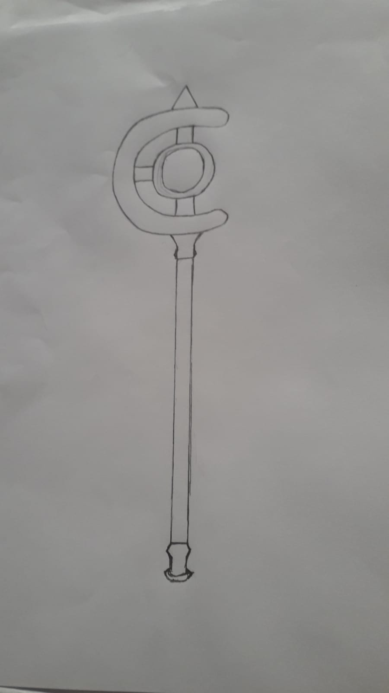

# Cajado 3D
Modelo 3d de um cajado - Trabalho feito a pedido do Prof. Vinícius.
<i>Por Igor Michelini e Christian Varandas</i>

A personagem escolhida foi Reimu Hakurei, do Touhou 19

# Desenho Base

</img>

# Explicação

Reimu é conhecida por ser uma sacerdotisa habilidosa, com habilidades notórias como:
Flutuar
Manipulação de Auras
Técnicas de barreiras
Esferas Yin Yang
O cajado seria um ótima adição ao repertório dela, sendo capaz de executar magias para exterminar Yokais
